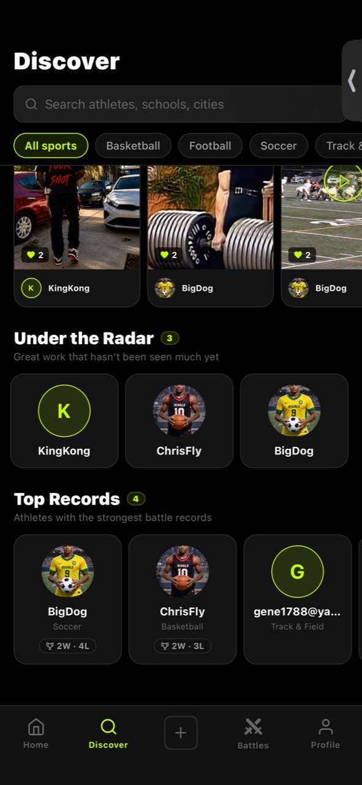
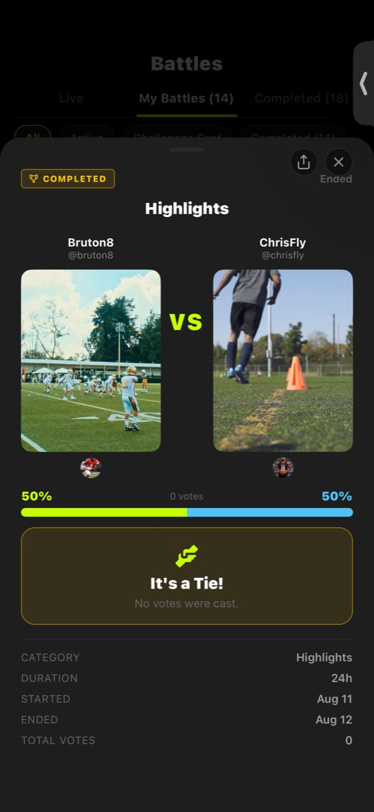

# Momentum MVP

Momentum MVP is an Expo + Firebase mobile app for sports creators to post media, challenge other athletes to battles, vote on matchups, and track profile stats.

The app uses Expo Router for navigation, Firebase Auth for accounts, Firestore for social data, Firebase Storage for media, and Firebase Cloud Functions for server-side battle finalization.

## Product Preview

<table>
  <tr>
    <td align="center"><br><sub>Home Feed</sub></td>
    <td align="center"><br><sub>Discover</sub></td>
    <td align="center"><br><sub>Athlete Profile</sub></td>
  </tr>
  <tr>
    <td align="center"><br><sub>Battle Tie Result</sub></td>
    <td align="center"><br><sub>Battle Winner Result</sub></td>
    <td></td>
  </tr>
</table>

## Features

- Email/password registration and login
- Home feed with media posts
- Image/video upload from device media
- Sports battle creation, acceptance, voting, and results
- User profiles with avatar, sport, bio, wins, losses, and post count
- Follow graph and profile discovery hooks
- Firestore and Storage security rules
- Cloud Functions project for server-owned stat updates

## Tech Stack

- Expo SDK 50
- React Native 0.73
- Expo Router
- TypeScript
- Firebase JS SDK
- Firebase Cloud Functions
- Zustand

## Repository Safety

This repository is prepared for public GitHub publishing. The following files are intentionally ignored and must stay local:

- `.env` and other local env files
- `GoogleService-Info.plist`
- `google-services.json`
- Firebase service account keys
- Firebase debug logs and emulator/cache data
- Expo local state and generated build output
- `node_modules/`

Firebase Web App config values used by `EXPO_PUBLIC_FIREBASE_*` are not admin credentials, but they still point clients at your Firebase project. Keep production projects protected with Firebase Auth, Firestore rules, Storage rules, App Check where appropriate, and locked-down billing/quotas.

## Prerequisites

- Node.js 18+
- npm
- Expo CLI through `npx expo`
- Firebase CLI if you deploy rules/functions
- EAS CLI if you build native apps
- A Firebase project with Auth, Firestore, Storage, and Functions enabled

## Environment Setup

Create a local env file:

```bash
cp .env.example .env
```

Fill in `.env` from Firebase Console:

1. Open Firebase Console.
2. Go to Project settings.
3. Create or select a Web App.
4. Copy the Web App SDK config into the `EXPO_PUBLIC_FIREBASE_*` fields.
5. Set `FIREBASE_PROJECT_ID` to the Firebase project ID.

For native EAS builds, download the platform service files from Firebase Console and place them at:

```text
GoogleService-Info.plist
google-services.json
```

Do not commit those files.

## Install

```bash
npm install
cd functions
npm install
cd ..
```

## Run Locally

```bash
npm start
```

Useful alternatives:

```bash
npm run start:clear
npm run ios
npm run android
npm run web
```

## Firebase Deploys

Deploy rules and indexes:

```bash
npx firebase deploy --only firestore:rules,firestore:indexes,storage --project "$FIREBASE_PROJECT_ID"
```

Build and deploy functions:

```bash
cd functions
npm run build
npx firebase deploy --only functions --project "$FIREBASE_PROJECT_ID"
cd ..
```

## Maintenance Scripts

The scripts in `scripts/` are destructive admin tools for clearing and restoring demo Firestore data. They require:

- `FIREBASE_PROJECT_ID` in the environment
- `scripts/serviceAccountKey.json` downloaded from Firebase Console

Run a dry run before deleting anything:

```bash
FIREBASE_PROJECT_ID=your-project-id DRY_RUN=true node scripts/cleanup-firestore.js
```

The service account key and generated backups are ignored by Git.

## Public GitHub Checklist

Before pushing publicly:

1. Confirm `git status --short` does not include `.env`, native Google service files, service account keys, `dist/`, `.expo/`, or debug logs.
2. Run a secret scan such as `git grep -n -I -E "AIza|PRIVATE KEY|private_key|client_email"`.
3. If this repository already has local commits containing secrets, publish from a fresh orphan branch or a fresh repository history instead of pushing the old history.
4. Create a private backup before rewriting history or changing remotes.

## Project Structure

```text
app/                 Expo Router screens and layouts
components/          Shared UI components
config/firebase.ts   Firebase client initialization
constants/           Theme constants
functions/           Firebase Cloud Functions
hooks/               Firestore-backed React hooks
scripts/             Admin cleanup and rollback tools
store/               Zustand auth store
types/               Shared TypeScript types
utils/               Media, navigation, and sharing helpers
```

## License

No license has been selected yet. Until a license is added, all rights are reserved by the project owner.
