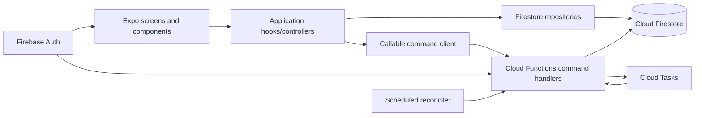
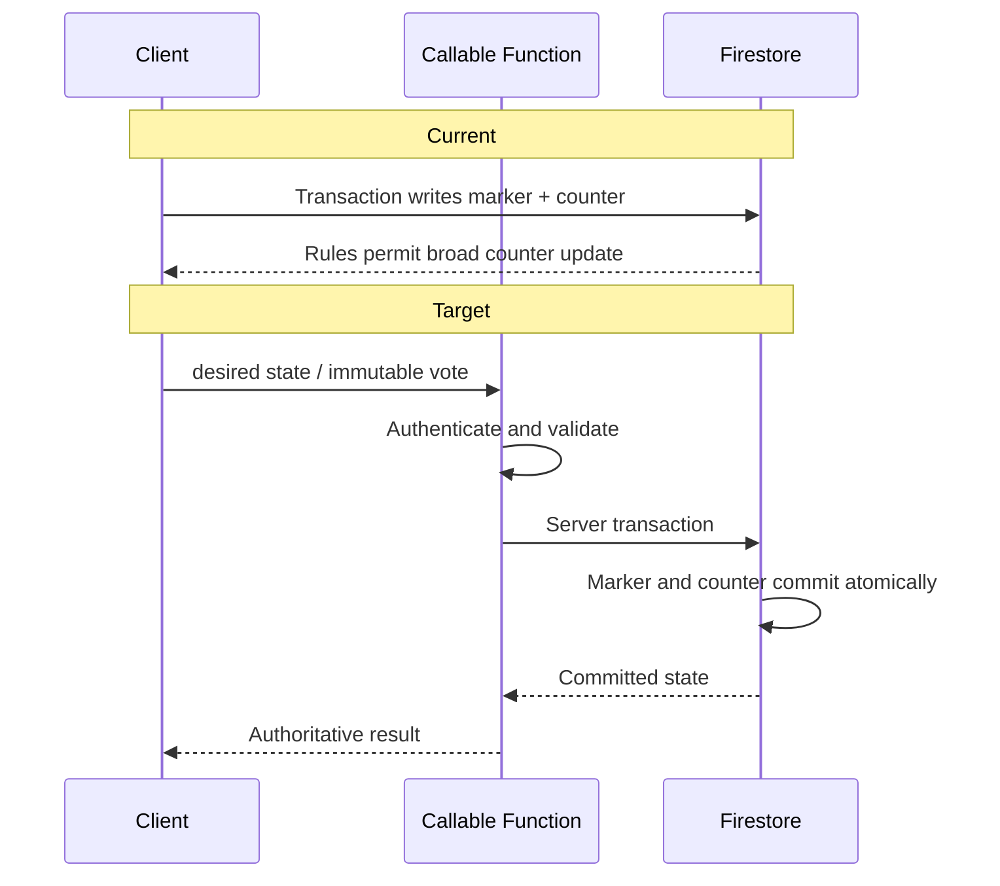
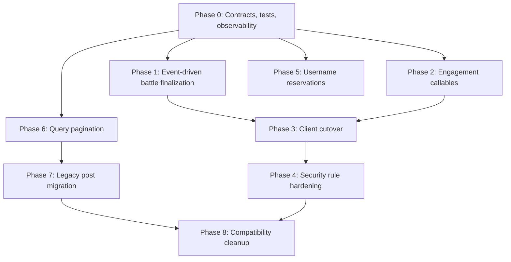
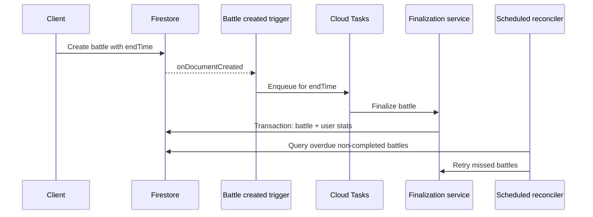

# Momentum Server-Authoritative Architecture Execution Plan

Status: planning only  
Scope: engagement writes, battle finalization, security rules, usernames,
query performance, and legacy post compatibility  
Non-goals: UI redesign, new product features, destructive migration, automatic
deployment, or behavior changes during this planning pass

## Executive decision

Momentum should move mutable engagement invariants behind authenticated Cloud
Functions while keeping Firestore as the read model.

The safe rollout order is:

1. Add contracts, emulator tests, metrics, and additive server functions.
2. Run new finalization infrastructure alongside the existing client fallback.
3. Release clients that use server-authoritative engagement commands.
4. Measure client adoption and server success rates.
5. Tighten Firestore rules only after supported clients no longer depend on
   direct engagement writes.
6. Migrate usernames and legacy posts additively.
7. Remove compatibility paths only after verification and a rollback window.

The central deployment invariant is:

> Functions before clients, clients before restrictive rules, migrations before
> compatibility cleanup.

## Target architecture



### Write ownership

| Data | Client may write | Server owns |
| --- | --- | --- |
| User profile | Bio, sport, avatar after validation | Username reservation, stats, counters |
| Post | Caption and battle-enabled state for owned post | Like counter and post counter |
| Like | Nothing after cutover | Like marker and `likesCount` |
| Battle | Transitional create only; eventually command-based | Vote counters, status, winner, finalization |
| Vote | Nothing after cutover | Immutable vote marker and vote counter |
| Follow | Existing direct writes may remain | No change in this plan |
| Username reservation | Nothing | Reservation lifecycle and profile username |

## Current and target engagement flow



## Phase dependency map



Phases 1, 2, 5 audit tooling, and query inventory can be developed in parallel
after Phase 0. Production cutovers remain ordered.

## Implementation plan

### Phase 0: contracts, emulator tests, and rollout instrumentation

Objective: establish a safety net without changing production behavior.

Work:

- Define callable request/response contracts for:
  - `setPostLike`
  - `castBattleVote`
  - `claimUsernameAndCreateProfile`
  - `renameUsername`
  - internal `finalizeBattle`
- Extract shared authentication, validation, error mapping, and transaction
  helpers in the Functions project.
- Add Firestore rules emulator tests for existing behavior and proposed
  hardened behavior.
- Add Functions emulator tests for duplicate requests, transaction retries,
  malformed data, missing documents, expired battles, and ties.
- Add structured logs with command name, document ID, caller UID, result,
  latency, and idempotency outcome. Never log tokens, email, media URLs, or
  profile biographies.
- Record a release identifier in function logs so client adoption can be
  measured before rule hardening.

Dependencies: none.

Risk: low. Test configuration may expose pre-existing rule assumptions.

Rollback: revert test/configuration commits; no production state is touched.

Complexity: medium.

Affected files:

- `functions/src/index.ts`
- `functions/src/shared/auth.ts` (new)
- `functions/src/shared/errors.ts` (new)
- `functions/src/shared/validation.ts` (new)
- `functions/src/contracts/engagement.ts` (new)
- `functions/src/contracts/profiles.ts` (new)
- `functions/src/contracts/battles.ts` (new)
- `functions/test/**/*.test.ts` (new)
- `test/firestore.rules.test.ts` (new)
- `functions/package.json`
- `package.json`
- `firebase.json`

Verification:

```bash
npm run typecheck
npm --prefix functions run build
npm run test:rules
npm run test:functions:emulator
npm run verify
```

Exit criteria:

- Current rule behavior is captured by tests.
- Every command contract has typed success and typed error responses.
- Tests can run against local emulators without production credentials.

### Phase 1: event-driven battle finalization

Objective: stop depending on users opening the battle feed to close battles.

Recommended design:

1. An `onDocumentCreated("battles/{battleId}")` trigger validates `endTime` and
   enqueues a finalization task for that timestamp.
2. The task invokes one internal finalization service.
3. A scheduled reconciler runs every 5 minutes and queries only:
   - `status in ["open", "live"]`
   - `endTime <= now`
   - bounded batches with cursors
4. The existing callable temporarily invokes the same internal service and
   remains as a rollback/fallback path.
5. The client-driven invocation is removed only after task and reconciler
   success are verified.



#### Finalization transaction boundary

One Firestore transaction must:

1. Read `battles/{battleId}`.
2. Return `already_finalized` if `statsRecorded == true`.
3. Validate server time is past authoritative `endTime`.
4. Validate player IDs and vote counters.
5. Compute winner and loser.
6. Update battle:
   - `status: "completed"`
   - `winner`
   - `statsRecorded: true`
   - `finalizedAt: serverTimestamp()`
   - optional internal `finalizationVersion`
7. Increment winner/loser stats in the same transaction.

No external API call belongs inside this transaction.

#### Double-finalization prevention

- `statsRecorded` remains the transaction guard.
- Concurrent task, scheduler, and legacy callable executions all read the same
  battle document.
- Firestore transaction retries ensure only one execution transitions
  `statsRecorded` from false to true.
- All later executions return the stored result without incrementing stats.

#### Failure recovery

- Cloud Tasks retries transient failures with bounded exponential backoff.
- The scheduled reconciler catches missing tasks, trigger delivery failures,
  deployment gaps, and exhausted retries.
- Permanently malformed battles are logged with a stable error code and left
  unmodified for manual repair.
- A bounded admin repair command may call the same finalization service for a
  specific battle. It must not contain separate winner/stat logic.
- Alert on overdue eligible battles older than 15 minutes and task failure rate.

Dependencies: Phase 0 contracts and tests.

Risk: medium-high.

- Cloud Tasks requires billing, IAM, and queue configuration.
- Firestore events and task delivery are at least once.
- Incorrect time-zone or timestamp handling could finalize early.
- Existing battles without valid `endTime` require reconciler compatibility
  with `createdAt + duration`.

Rollback:

- Keep the existing callable deployed.
- Disable the create trigger and scheduler without deleting queued tasks.
- Queued tasks are harmless because finalization is idempotent.
- Restore client invocation if the restrictive rules have not changed.
- Do not revert finalized battle documents or user stats automatically.

Complexity: large.

Affected files:

- `functions/src/index.ts`
- `functions/src/battles/finalizeBattle.ts` (new)
- `functions/src/battles/onBattleCreated.ts` (new)
- `functions/src/battles/finalizeBattleTask.ts` (new)
- `functions/src/battles/sweepExpiredBattles.ts` (new)
- `functions/src/battles/time.ts` (new)
- `functions/test/battles/*.test.ts` (new)
- `hooks/useBattles.ts`
- `firestore.indexes.json`
- `functions/package.json`
- `firebase.json`

Required index:

```json
{
  "collectionGroup": "battles",
  "queryScope": "COLLECTION",
  "fields": [
    { "fieldPath": "status", "order": "ASCENDING" },
    { "fieldPath": "endTime", "order": "ASCENDING" }
  ]
}
```

Verification:

```bash
npm --prefix functions run build
npm run test:functions:emulator -- --grep battle
npx firebase emulators:exec --only firestore,functions \
  "npm run test:integration:battle-finalization"
npx firebase deploy --only firestore:indexes --project "$STAGING_PROJECT_ID"
npx firebase deploy --only functions --project "$STAGING_PROJECT_ID"
```

Staging checks:

- New open and live battles finalize without opening the app.
- Ties do not alter win/loss counters.
- Duplicate tasks increment stats once.
- Reconciler finalizes an intentionally unqueued expired battle.
- Client logical countdown remains unchanged.

### Phase 2: server-authoritative engagement commands

Objective: make like and vote documents plus counters server-owned.

#### Likes: `setPostLike`

Use desired-state semantics, not toggle semantics.

Request:

```ts
type SetPostLikeRequest = {
  postId: string;
  liked: boolean;
  clientMutationId: string;
};
```

Response:

```ts
type SetPostLikeResponse = {
  postId: string;
  liked: boolean;
  likesCount: number;
  outcome: "applied" | "already_applied";
};
```

Transaction:

1. Authenticate caller.
2. Validate IDs and payload size.
3. Read `posts/{postId}` and `likes/{postId}_{uid}`.
4. If marker state already equals requested state, return
   `already_applied`; do not change the counter.
5. Otherwise create/delete the marker and update the post counter in the same
   transaction.
6. Set the exact new count based on the transaction read, never accept a client
   counter or delta.
7. Reject a missing post.

Desired state makes network retries idempotent. `clientMutationId` is retained
for tracing and future operation receipts, but correctness does not depend on a
separate receipt collection.

Client requirement: serialize like mutations per post. A second tap may update
the desired local state, but it must wait for or supersede the first request.
This prevents out-of-order `liked=true` and `liked=false` commands.

#### Battle votes: `castBattleVote`

Request:

```ts
type CastBattleVoteRequest = {
  battleId: string;
  side: "A" | "B";
  clientMutationId: string;
};
```

Response:

```ts
type CastBattleVoteResponse = {
  battleId: string;
  side: "A" | "B";
  votesA: number;
  votesB: number;
  outcome: "applied" | "already_applied";
};
```

Transaction:

1. Authenticate caller.
2. Read battle and deterministic vote document
   `votes/{battleId}_{uid}`.
3. Validate battle exists, is live, has not expired on the server clock, and
   has both players.
4. Reject participant self-voting, matching current intended UI behavior.
5. If a vote exists:
   - same side: return `already_applied`
   - different side: return `already-exists`; votes remain immutable
6. Create the vote document and increment exactly one counter atomically.
7. Return authoritative counters.

The deterministic vote document is the idempotency key. Transaction retries and
duplicate callable deliveries cannot create another vote.

#### Counter repair

Server ownership prevents new drift but does not repair old drift.

Add a dry-run audit script that compares:

- `posts.likesCount` to count of matching like documents
- `battles.votesA/votesB` to count of matching vote documents

Any repair must be a separately approved, backed-up, bounded migration. It is
not part of the initial cutover.

#### Offline behavior

Callable functions are not an offline write queue.

Preserve the current UX:

- Apply the same optimistic local update immediately.
- Keep one in-flight mutation per entity.
- If the callable reports unavailable/offline, revert to the last confirmed
  server state.
- Do not persist a pending engagement command across app restarts in the first
  release.
- Refresh marker state and counters on the next feed/battle load.
- Never report a vote as confirmed until the server returns success.

This matches current behavior more closely than silently queueing votes that
could arrive after a battle ends.

Dependencies: Phase 0.

Risk: medium.

- Optimistic state can diverge if per-entity serialization is incorrect.
- Existing counter drift remains visible.
- Function latency is higher than a local Firestore cache write.
- Old clients continue direct writes until rules are hardened.

Rollback:

- Keep current direct client functions available until the cutover release is
  validated.
- Roll back the app to direct writes only while permissive rules remain.
- After restrictive rules deploy, rollback must target the previous
  server-authoritative client, not a pre-cutover build.

Complexity: medium-large.

Affected files:

- `functions/src/index.ts`
- `functions/src/engagement/setPostLike.ts` (new)
- `functions/src/engagement/castBattleVote.ts` (new)
- `functions/src/engagement/counters.ts` (new)
- `functions/test/engagement/*.test.ts` (new)
- `services/engagementService.ts` (new)
- `hooks/usePosts.ts`
- `hooks/useBattles.ts`
- `app/(tabs)/battles.tsx`
- `scripts/audit-engagement-counters.js` (new)
- `scripts/CLEANUP.md`

Verification:

```bash
npm run typecheck
npm --prefix functions run build
npm run test:functions:emulator -- --grep engagement
npx firebase emulators:exec --only auth,firestore,functions \
  "npm run test:integration:engagement"
```

Required cases:

- Like, unlike, duplicate like, duplicate unlike.
- Retry with identical desired state.
- Rapid like/unlike serialization.
- First vote, duplicate same-side vote, conflicting second-side vote.
- Participant vote rejection.
- Vote after `endTime` rejection.
- Missing post/battle and malformed counters.
- Concurrent requests leave marker and counter consistent.

### Phase 3: client cutover and compatibility window

Objective: route supported clients through the new functions with no UI change.

Work:

- Replace `toggleLike` Firestore transaction with `setPostLike` callable.
- Replace `submitVote` Firestore transaction with `castBattleVote` callable.
- Continue optimistic UI updates and existing error behavior.
- Use authoritative counters returned by the server to reconcile optimistic
  state.
- Remove client-triggered finalization only after Phase 1 health criteria pass.
- Keep all reads and document shapes compatible.
- Monitor function not-found, unauthenticated, failed-precondition, latency,
  and transaction contention rates.

Deployment order:

1. Deploy functions.
2. Verify staging.
3. Release client.
4. Observe supported-version adoption.
5. Wait at least one normal release rollback window.
6. Proceed to Phase 4 only when old-client direct engagement traffic is below
   the accepted threshold.

Dependencies: Phases 1 and 2.

Risk: medium-high because mobile clients cannot be updated atomically.

Rollback:

- Before Phase 4: release the previous client; permissive rules still support it.
- After Phase 4: release the previous server-authoritative client only.
- Keep function response contracts backward compatible for at least two client
  releases.

Complexity: medium.

Affected files:

- `services/engagementService.ts`
- `hooks/usePosts.ts`
- `hooks/useBattles.ts`
- `app/(tabs)/battles.tsx`
- `config/firebase.ts` only if emulator or callable configuration is extracted
- `types/index.ts` or `types/engagement.ts` (new)

Verification:

```bash
npm run verify
npx expo export --platform ios
npx expo export --platform android
npx firebase emulators:exec --only auth,firestore,functions \
  "npm run test:e2e:engagement"
```

Manual regression:

- Like and unlike from the feed.
- Double-tap like.
- Vote from battle card and detail modal.
- Duplicate rapid taps.
- Offline action reverts cleanly.
- Refresh shows authoritative marker and counter.
- Battle countdown and result display are unchanged.

### Phase 4: Firestore security hardening

Objective: deny all client writes to protected counters and marker collections.

Dependencies: Phase 3 adoption threshold and rollback window.

Risk: high. Deploying these rules before client adoption breaks engagement for
old clients.

Rollback:

- Keep the previous rules file tagged and deployable.
- A rules rollback restores availability but reopens the known counter
  vulnerability.
- Prefer rolling forward with a function/client fix when possible.
- Test both new and previous rules against the same emulator suite.

Complexity: medium.

Affected files:

- `firestore.rules`
- `test/firestore.rules.test.ts`
- `firebase.json`
- deployment runbook documentation

#### Exact rule changes

##### Posts

Before:

```rules
allow update: if isSignedIn()
  && (
    resource.data.userId == request.auth.uid
    || changedKeys().hasOnly(['likesCount'])
  );
```

After:

```rules
function isPostOwnerUpdate() {
  return isOwner(resource.data.userId)
    && changedKeys().hasOnly([
      'caption',
      'battleEnabled',
      'updatedAt'
    ])
    && request.resource.data.likesCount == resource.data.likesCount
    && request.resource.data.userId == resource.data.userId;
}

allow update: if isSignedIn() && isPostOwnerUpdate();
```

The Admin SDK bypasses these rules and remains able to update `likesCount`.

##### Likes

Before:

```rules
allow create: if isSignedIn()
  && request.resource.data.userId == request.auth.uid
  && likeId == (request.resource.data.postId + '_' + request.auth.uid);
allow delete: if isOwner(resource.data.userId);
```

After:

```rules
allow read: if isSignedIn();
allow create, update, delete: if false;
```

##### Battles

Transitional after vote cutover but before acceptance cutover:

```rules
allow update: if isSignedIn() && isAcceptingChallenge();
```

Final target after challenge acceptance also becomes server-authoritative:

```rules
allow update: if false;
```

At minimum, remove:

```rules
function isVoteCounterUpdate() {
  return resource.data.status != 'completed'
    && changedKeys().hasOnly(['votesA', 'votesB']);
}
```

and remove it from `allow update`.

##### Votes

Before:

```rules
allow create: if isSignedIn()
  && request.resource.data.userId == request.auth.uid
  && voteId == (request.resource.data.battleId + '_' + request.auth.uid)
  && request.resource.data.side in ['A', 'B'];
```

After:

```rules
allow read: if isSignedIn();
allow create, update, delete: if false;
```

##### Users

Current protection of `wins`, `losses`, and `posts` remains, but update fields
should become an allowlist:

```rules
function isEditableProfileUpdate() {
  return isOwner(userId)
    && changedKeys().hasOnly([
      'bio',
      'sport',
      'athleteType',
      'avatar',
      'avatarUrl',
      'updatedAt'
    ]);
}

allow update: if isEditableProfileUpdate();
```

`username` is intentionally omitted after the username callable cutover.

##### Username reservations

```rules
match /usernames/{normalizedUsername} {
  allow read: if isSignedIn();
  allow create, update, delete: if false;
}
```

#### Deployment verification

```bash
npx firebase emulators:exec --only auth,firestore \
  "npm run test:rules"
npx firebase deploy --only firestore:rules --project "$STAGING_PROJECT_ID"
npx firebase firestore:rules:get --project "$STAGING_PROJECT_ID"
```

Required denial tests:

- Client cannot increment/decrement `likesCount`.
- Client cannot create/delete like markers.
- Client cannot increment/decrement vote counters.
- Client cannot create vote markers.
- Post owner cannot alter author, media, counter, or creation fields.
- User cannot alter stats or username directly.

Required allow tests:

- Signed-in users retain current reads.
- Post owners can edit current caption/battle-enabled fields.
- Profile owners can edit current non-username profile fields.
- Follow behavior remains unchanged.
- Transitional battle acceptance remains allowed until separately cut over.

### Phase 5: transaction-based username uniqueness

Objective: guarantee case-insensitive normalized uniqueness for new claims and
renames without changing existing display names automatically.

#### Reservation model

Document:

```text
usernames/{normalizedUsername}
```

Example:

```json
{
  "userId": "uid123",
  "displayUsername": "MomentumFan",
  "normalizedUsername": "momentumfan",
  "createdAt": "server timestamp",
  "updatedAt": "server timestamp"
}
```

Normalization contract:

1. Unicode normalize with NFKC.
2. Trim leading/trailing whitespace.
3. Lowercase using locale-independent rules.
4. Validate the current username length and allowed-character policy.
5. Use the resulting value as the document ID after rejecting `/`, `.`, `..`,
   control characters, and empty results.

The same shared normalization function must be used by migration scripts and
Cloud Functions. The client may mirror it for early validation but is never
authoritative.

#### New profile claim transaction

`claimUsernameAndCreateProfile`:

1. Authenticate caller and use `request.auth.uid`; never accept an owner UID.
2. Normalize requested username.
3. Transaction-read:
   - `usernames/{normalized}`
   - `users/{uid}`
4. If reservation belongs to another user or is marked conflicted, return
   `already-exists`.
5. If the profile already exists with the same reservation, return
   `already_applied`.
6. Create reservation and profile in the same transaction.

Firebase Auth account creation remains client-side. If profile claim fails, the
current cleanup behavior may delete/sign out the just-created Auth user.

#### Rename transaction

`renameUsername`:

1. Read user profile, old reservation, and new reservation.
2. Reject if the new reservation is owned or conflicted.
3. Create new reservation.
4. Update `users/{uid}.username`.
5. Delete old reservation only if it is owned by the same UID.
6. Commit atomically.

Posts and battles keep their existing denormalized username snapshots in this
phase, preserving current behavior.

#### Existing username migration

Migration is additive and dry-run first.

1. Export/backup `users`.
2. Scan all profiles and produce:
   - unique normalized usernames
   - exact duplicates
   - case/Unicode normalization collisions
   - invalid/empty usernames
3. Generate a review artifact with UID, displayed username, normalized value,
   and creation timestamp.
4. For unique valid names, create reservation documents in bounded batches
   using create-if-absent semantics.
5. For collisions, create a non-claimable conflict reservation:

```json
{
  "state": "conflicted",
  "userIds": ["uidA", "uidB"],
  "normalizedUsername": "same-name"
}
```

6. Do not rename, delete, or merge existing profiles automatically.
7. Resolve collisions later through explicit owner decisions. Until then,
   existing users retain their names and nobody can newly claim that normalized
   value.
8. Re-run the audit and require:
   - every valid unique user has one owned reservation
   - every collision has one conflict reservation
   - no reservation is owned by multiple UIDs

Dependencies: Phase 0. Rule hardening for username writes occurs only after
client registration/profile editing use the callables.

Risk: high.

- Normalization changes can create unexpected collisions.
- Auth account creation and profile creation are separate systems.
- Existing profile editing currently permits direct username changes.

Rollback:

- Reservation documents are additive.
- Keep the legacy username query available during migration.
- If cutover fails, restore direct profile flow while rules remain permissive.
- Never bulk-delete reservations during rollback; mark the migration inactive
  in deployment configuration and investigate.

Complexity: large.

Affected files:

- `functions/src/index.ts`
- `functions/src/profiles/usernameNormalization.ts` (new)
- `functions/src/profiles/claimUsernameAndCreateProfile.ts` (new)
- `functions/src/profiles/renameUsername.ts` (new)
- `functions/test/profiles/usernames.test.ts` (new)
- `app/(auth)/register.tsx`
- `app/(tabs)/profile.tsx`
- `hooks/useProfile.ts`
- `services/profileService.ts` (new)
- `firestore.rules`
- `scripts/audit-usernames.js` (new)
- `scripts/migrate-username-reservations.js` (new)
- `scripts/CLEANUP.md`

Verification:

```bash
npm run typecheck
npm --prefix functions run build
npm run test:functions:emulator -- --grep username
DRY_RUN=true node scripts/audit-usernames.js
DRY_RUN=true node scripts/migrate-username-reservations.js
```

Required concurrency tests:

- Two users claim identical normalized names simultaneously.
- Case variants collide.
- Unicode-equivalent variants collide.
- Retry by the winning user is idempotent.
- Rename frees only the caller's old reservation.
- Failed rename leaves old reservation and profile unchanged.

### Phase 6: query pagination and bounded reads

Objective: bound read cost and latency while preserving list ordering and UX.

#### Current query inventory

| Query | Location | Current bound | Problem | Recommendation |
| --- | --- | ---: | --- | --- |
| Global posts | `hooks/usePosts.ts` | 20 | No next-page cursor | Add `startAfter` cursor and repository page result |
| User likes | `hooks/usePosts.ts:fetchLikedPostIds` | Unbounded | Reads every historical like | Query only current page post IDs |
| User posts | `services/postRepository.ts:fetchPostsByUser` | Unbounded x3 | Reads all aliases and all history | Canonical field plus `orderBy`, `limit`, cursor |
| Following IDs | `hooks/useFollows.ts:fetchFollowedIds` | Unbounded | Entire follow graph loaded | Materialized feed long-term; page-author checks short-term |
| Following posts | `services/postRepository.ts:fetchPostsByUsers` | Per-query 20 | Fan-out and over-read | Canonical author field; then timeline if needed |
| Battles | `hooks/useBattles.ts` | Unbounded | Full history and second full read | Status-specific 20-item pages |
| User votes | `hooks/useBattles.ts:fetchVotedBattleIds` | Unbounded | Reads all historical votes | Query/get markers for visible battle IDs only |
| Username lookup | `hooks/useProfile.ts:isUsernameTaken` | 1 | Race, not read volume | Replace with reservation document |
| Battle picker posts | `components/BattlePickerModal.tsx` via repository | Unbounded x3 | Loads full user history | First page, then optional existing scroll behavior |
| Accept modal posts | `app/(tabs)/battles.tsx` via repository | Unbounded x3 | Loads full user history | First page sufficient for current modal |
| Cleanup script | `scripts/cleanup-firestore.js` | Batched | Admin-only loop | Keep bounded batches |

#### Pagination contract

Repository page:

```ts
type Page<T> = {
  items: T[];
  cursor: string | null;
  hasMore: boolean;
};
```

Use document snapshot cursors internally; serialize only stable cursor fields if
a cursor must cross a process boundary.

Recommended page sizes:

- Global/following posts: 20
- User profile posts: 24
- Battle tabs: 20 per status
- Picker/accept modal: 30

Queries:

```text
posts orderBy(createdAt desc), limit(pageSize)
posts where(userId == uid), orderBy(createdAt desc), limit(pageSize)
battles where(status == tabStatus), orderBy(createdAt desc), limit(pageSize)
```

For visible engagement markers:

- Likes: query `likes` by caller UID and `postId in [visible IDs]`, or read
  deterministic marker documents for the page.
- Votes: query `votes` by caller UID and `battleId in [visible IDs]`, or read
  deterministic marker documents for the page.
- Keep batches within the deployed SDK/operator limit.

#### Estimated read reduction

These are directional estimates; actual savings depend on user history and
cache hit rates.

| Scenario | Current | Target | Approximate reduction |
| --- | ---: | ---: | ---: |
| 500 battles, refresh triggers reread | Up to 1,000 battle reads plus all user votes | 20 battles plus visible vote markers | 95%+ |
| User has 500 historical likes | 20 posts + 500 likes | 20 posts + page marker query | About 92% |
| Profile has 100 canonical posts written under all aliases | Up to 300 reads | 24 reads | About 92% |
| Following 100 users | Up to 30 queries x 20 returned docs | 10 canonical queries x 20 | Up to 67% before timeline materialization |
| Materialized following timeline | Up to 600 post reads in worst fan-out | 20 timeline reads | Up to 97% |

Materialized timelines are not required for the immediate MVP cutover. Add them
only after measured fan-out cost justifies the write amplification.

Dependencies:

- Global and battle pagination can begin after Phase 0.
- Efficient user/following post pagination depends on Phase 7 canonical fields.

Risk: medium.

- Cursor invalidation during refresh must reset page state cleanly.
- Client-side legacy merging cannot provide globally correct cursors.
- Status changes can move battles between paginated tabs.

Rollback:

- Retain current repository methods during one release.
- Fall back to first-page fetch if cursor loading fails.
- Index additions are additive and may remain deployed.

Complexity: large across all lists; medium per query.

Affected files:

- `services/postRepository.ts`
- `services/battleRepository.ts` (new)
- `services/engagementRepository.ts` (new)
- `hooks/usePosts.ts`
- `hooks/useBattles.ts`
- `hooks/useFollows.ts`
- `components/BattlePickerModal.tsx`
- `app/(tabs)/battles.tsx`
- `app/(tabs)/index.tsx`
- `app/(tabs)/profile.tsx`
- `app/profile/[userId].tsx`
- `firestore.indexes.json`
- `types/pagination.ts` (new)

Verification:

```bash
npm run typecheck
npm run test:repositories
npx firebase emulators:exec --only firestore \
  "npm run test:integration:pagination"
```

Required cases:

- Stable newest-first order across pages.
- No duplicates when documents are inserted during pagination.
- Refresh resets cursor and does not append stale results.
- Empty, partial, and exact-full pages.
- Battle status transition does not corrupt another tab's state.

### Phase 7: legacy post migration

Objective: converge posts on one queryable schema without breaking old data.

#### Legacy field inventory

| Concept | Canonical target | Compatibility inputs currently accepted |
| --- | --- | --- |
| Author ID | `userId` | `authorId`, `uid`, `ownerId` |
| Username snapshot | `username` | `displayName` |
| Media URL | `mediaUrl` | `mediaURL`, `photoURL` |
| Avatar snapshot | `userAvatar` | `avatarUrl`, `avatar`, `photoURL` |
| Media type | `mediaType` | Missing/incorrect value inferred from URL |
| Created time | `createdAt` | Missing/null values |
| Battle eligibility | `battleEnabled` | Missing defaults to false |
| Like count | `likesCount` | Missing/non-number defaults to zero |

Current new writes also duplicate `userId` into `authorId` and `uid`. That
compatibility write should stop only after backfill and verification.

#### Stage A: compatibility

- Keep `normalizePost`.
- Keep alias queries.
- Add schema-version logging/audit only.
- Define a canonical post validator shared by migration and server code.
- Add `schemaVersion` only when a future write path is already being touched;
  do not rewrite all posts solely for this field.

Risk: low.

#### Stage B: dry-run inventory

Produce counts for:

- total posts
- posts missing each canonical field
- conflicting aliases, such as `userId != authorId`
- unresolvable author IDs
- missing/invalid timestamps
- ambiguous `photoURL` usage as media versus avatar
- inferred video types
- posts with no renderable media

Export document IDs and proposed patches. Do not include full media URLs in
logs.

Risk: low.

#### Stage C: additive backfill

- Backup/export first.
- Patch only missing canonical fields.
- Never overwrite a canonical field when aliases disagree.
- Put conflicts in a review report.
- Use bounded batches with resumable checkpoints.
- Record migration version and run ID in logs, not necessarily in every
  document.
- Re-run the inventory after every batch.

Risk: medium.

#### Stage D: canonical writes and reads

- Stop writing `authorId` and `uid` for new posts.
- Query only `userId`.
- Keep `normalizePost` alias fallbacks for at least two releases.
- Retain a compatibility read fallback for specifically identified unresolved
  documents, not for the entire collection.

Risk: medium-high because query behavior changes.

#### Stage E: cleanup

Only after:

- zero unresolved author conflicts, or an explicit exception list
- 100% of renderable posts have canonical query fields
- production metrics show no compatibility fallback use for the rollback window
- backups are verified

Then:

- remove alias fan-out queries
- remove duplicate alias writes
- later remove normalization fallbacks
- do not delete legacy fields unless storage/index cost justifies a separately
  approved destructive migration

Dependencies: Phase 0 audit harness. Canonical query cutover precedes efficient
Phase 6 user/following pagination.

Risk: medium-high.

Rollback:

- Backfill is additive.
- Keep alias fields and normalization during rollback window.
- Re-enable alias query path if canonical query metrics disagree.
- Never auto-delete posts with unresolved data.

Complexity: large.

Affected files:

- `services/postRepository.ts`
- `hooks/usePosts.ts`
- `types/index.ts`
- `firestore.indexes.json`
- `scripts/audit-post-schema.js` (new)
- `scripts/migrate-post-schema.js` (new)
- `scripts/rollback-post-schema.js` (new, restores only from captured backup)
- `scripts/CLEANUP.md`

Verification:

```bash
DRY_RUN=true node scripts/audit-post-schema.js
DRY_RUN=true node scripts/migrate-post-schema.js
npm run test:repositories
npm run verify
```

Staging migration checks:

- Pre/post document counts match.
- No canonical value is overwritten.
- Canonical and compatibility query result IDs match.
- Media rendering and ordering match before and after.

### Phase 8: compatibility cleanup

Objective: remove transitional code only after all safety conditions are met.

Work:

- Remove client `finalizeBattle` calls.
- Remove direct client engagement transaction implementations.
- Remove permissive counter rule branches.
- Remove alias fan-out queries.
- Remove legacy callable exports only after two compatible client releases.
- Keep server transaction services and reconciliation tools.

Dependencies: Phases 4 and 7 complete, metrics stable, rollback window elapsed.

Risk: medium. Cleanup can remove an unnoticed fallback.

Rollback: reintroduce compatibility code from the preceding tagged release.
Do not loosen rules unless required to restore an active supported client.

Complexity: medium.

## Ordered TODO checklist

### Safety foundation

- [ ] Define typed callable contracts and stable error codes.
- [ ] Extract shared Functions authentication and validation.
- [ ] Add Firestore rules emulator tests for current behavior.
- [ ] Add Functions emulator transaction/concurrency tests.
- [ ] Add structured logs and staging dashboards.
- [ ] Define supported-client adoption threshold for rule hardening.

### Battle finalization

- [ ] Extract the existing finalizer into one internal transaction service.
- [ ] Keep the existing callable as a wrapper.
- [ ] Add battle-created enqueue trigger.
- [ ] Add task handler with retry policy.
- [ ] Add overdue-battle composite index.
- [ ] Add scheduled reconciliation sweep with bounded pages.
- [ ] Test duplicate task/callable/scheduler execution.
- [ ] Verify old battles without `endTime`.
- [ ] Remove client finalization only after staging and production health checks.

### Likes and votes

- [ ] Implement desired-state `setPostLike`.
- [ ] Implement immutable `castBattleVote`.
- [ ] Return authoritative counters from both commands.
- [ ] Add per-post mutation serialization in the client.
- [ ] Preserve optimistic updates and revert-on-failure behavior.
- [ ] Add dry-run engagement counter audit.
- [ ] Release client while rules remain compatible.
- [ ] Measure old direct-write traffic.

### Rules

- [ ] Remove client `likesCount` writes.
- [ ] Deny client like marker writes.
- [ ] Remove client vote counter writes.
- [ ] Deny client vote marker writes.
- [ ] Restrict post owner updates to explicit editable fields.
- [ ] Restrict user updates to explicit editable fields.
- [ ] Keep follow behavior unchanged.
- [ ] Test and deploy to staging.
- [ ] Deploy production rules only after adoption gate.

### Usernames

- [ ] Finalize normalization rules.
- [ ] Implement reservation create/rename transactions.
- [ ] Add username audit dry run.
- [ ] Review all normalization collisions.
- [ ] Create unique and conflict reservations additively.
- [ ] Cut registration over to profile claim callable.
- [ ] Cut profile rename over to rename callable.
- [ ] Deny direct username writes only after client adoption.

### Queries

- [ ] Add a common page/cursor type.
- [ ] Paginate global posts.
- [ ] Paginate battle tabs and remove full collection reread.
- [ ] Load like markers only for visible posts.
- [ ] Load vote markers only for visible battles.
- [ ] Paginate canonical user posts.
- [ ] Bound picker and accept-modal post queries.
- [ ] Measure following feed fan-out before considering materialized timelines.

### Legacy posts

- [ ] Run legacy schema inventory.
- [ ] Review conflicting aliases and unresolvable authors.
- [ ] Back up Firestore.
- [ ] Run additive backfill in staging.
- [ ] Compare canonical and compatibility query results.
- [ ] Run bounded production backfill after approval.
- [ ] Stop duplicate alias writes.
- [ ] Remove alias fan-out after the rollback window.
- [ ] Retain normalization fallback until usage reaches zero.

## Suggested commit sequence

Each commit should be independently buildable. Deployment commits and client
cutover commits must remain separable.

1. `test: add emulator harness for functions and firestore rules`
2. `refactor(functions): extract shared command contracts and validation`
3. `refactor(functions): extract idempotent battle finalization service`
4. `feat(functions): enqueue and reconcile battle finalization`
5. `test(functions): cover duplicate and failed battle finalization`
6. `feat(functions): add server-authoritative post like command`
7. `feat(functions): add server-authoritative battle vote command`
8. `test(functions): cover engagement retries and concurrency`
9. `refactor(client): route likes and votes through callable services`
10. `refactor(client): remove read-driven battle finalization`
11. `security(rules): deny client engagement counter and marker writes`
12. `feat(functions): add transactional username reservations`
13. `chore(migration): add dry-run username audit and reservation backfill`
14. `refactor(client): use username claim and rename commands`
15. `security(rules): deny direct username writes`
16. `refactor(data): add paginated post and battle repositories`
17. `perf(client): load engagement markers only for visible pages`
18. `chore(migration): add legacy post schema audit`
19. `chore(migration): add additive canonical post backfill`
20. `refactor(data): switch post writes and queries to canonical fields`
21. `cleanup(data): remove legacy alias fan-out after verification window`

Do not combine commits 9 and 11. The client must be deployable and observable
before restrictive rules are committed for deployment.

## Exact file impact summary

### Existing files expected to change

- `functions/src/index.ts`
- `functions/package.json`
- `functions/tsconfig.json` if test source separation is required
- `hooks/usePosts.ts`
- `hooks/useBattles.ts`
- `hooks/useProfile.ts`
- `hooks/useFollows.ts`
- `services/postRepository.ts`
- `config/firebase.ts`
- `types/index.ts`
- `app/(auth)/register.tsx`
- `app/(tabs)/index.tsx`
- `app/(tabs)/battles.tsx`
- `app/(tabs)/profile.tsx`
- `app/profile/[userId].tsx`
- `components/BattlePickerModal.tsx`
- `firestore.rules`
- `firestore.indexes.json`
- `firebase.json`
- `package.json`
- `scripts/CLEANUP.md`

### New files expected

- `functions/src/shared/auth.ts`
- `functions/src/shared/errors.ts`
- `functions/src/shared/validation.ts`
- `functions/src/contracts/engagement.ts`
- `functions/src/contracts/profiles.ts`
- `functions/src/contracts/battles.ts`
- `functions/src/engagement/setPostLike.ts`
- `functions/src/engagement/castBattleVote.ts`
- `functions/src/engagement/counters.ts`
- `functions/src/battles/finalizeBattle.ts`
- `functions/src/battles/onBattleCreated.ts`
- `functions/src/battles/finalizeBattleTask.ts`
- `functions/src/battles/sweepExpiredBattles.ts`
- `functions/src/battles/time.ts`
- `functions/src/profiles/usernameNormalization.ts`
- `functions/src/profiles/claimUsernameAndCreateProfile.ts`
- `functions/src/profiles/renameUsername.ts`
- `services/engagementService.ts`
- `services/engagementRepository.ts`
- `services/battleRepository.ts`
- `services/profileService.ts`
- `types/engagement.ts`
- `types/pagination.ts`
- `test/firestore.rules.test.ts`
- `functions/test/engagement/*.test.ts`
- `functions/test/battles/*.test.ts`
- `functions/test/profiles/*.test.ts`
- `scripts/audit-engagement-counters.js`
- `scripts/audit-usernames.js`
- `scripts/migrate-username-reservations.js`
- `scripts/audit-post-schema.js`
- `scripts/migrate-post-schema.js`
- `scripts/rollback-post-schema.js`

This is an implementation forecast, not authorization to create every file.
Small adjacent modules may be consolidated when implementation begins, provided
the domain boundaries remain intact.

## Risk register

| Risk | Severity | Mitigation |
| --- | --- | --- |
| Rules deploy before client adoption | Critical | Functions → client → adoption gate → rules |
| Duplicate function/task delivery | High | Deterministic marker IDs and transaction guards |
| Mobile client rollback after rules hardening | High | Roll back only to prior server-authoritative client |
| Existing counter drift | High | Dry-run audit; separate approved repair |
| Username normalization collisions | High | Conflict reservations; no automatic rename |
| Task enqueue failure | Medium | Scheduled reconciliation sweep |
| Callable latency affects perceived UX | Medium | Preserve optimistic state; reconcile response |
| Offline vote arrives after battle end | High | Do not queue votes across restarts |
| Legacy query results differ after migration | High | Compare ID sets before cutover |
| Pagination duplicates/skips during writes | Medium | Stable order, snapshot cursor, refresh reset |
| Firestore transaction contention on popular posts | Medium | Monitor retries; consider distributed counters only after evidence |

## Rollback matrix

| Stage | Safe rollback |
| --- | --- |
| Functions added, no client change | Remove/disable new exports; no data rollback |
| Finalization tasks enabled | Disable enqueue/scheduler; keep idempotent finalizer |
| New client, permissive rules | Roll back to previous client |
| Hardened rules | Roll back to previous server-authoritative client; rule rollback only as emergency |
| Username reservations migrated | Keep additive reservations; switch client path back before username rule hardening |
| Canonical posts backfilled | Re-enable compatibility queries; do not remove canonical fields |
| Alias queries removed | Restore compatibility repository from tagged release |

## Production readiness gates

Do not advance to restrictive rules until all are true:

- Function success rate meets the agreed SLO for seven consecutive days.
- P95 callable latency is acceptable for the existing optimistic UX.
- Duplicate delivery tests pass.
- No unexplained marker/counter divergence appears in dry-run audits.
- Supported client adoption exceeds the agreed threshold.
- A rollback client build is available.
- Staging rules tests and manual regression pass.
- On-call owner and deployment window are identified.

Do not remove compatibility post reads until all are true:

- Canonical audit reports complete coverage or an approved exception list.
- Canonical and compatibility query ID sets match in staging and sampled
  production dry runs.
- No compatibility fallback usage is observed during the rollback window.
- Firestore export/backup is verified.

## Reference documentation

- [Firebase task queue functions](https://firebase.google.com/docs/functions/task-functions)
- [Firebase scheduled functions](https://firebase.google.com/docs/functions/schedule-functions)
- [Firestore transactions and batched writes](https://firebase.google.com/docs/firestore/manage-data/transactions)
- [Firestore field-level security rules](https://firebase.google.com/docs/firestore/security/rules-fields)

